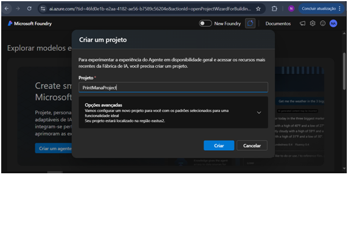

# PrintMana – Controle Inteligente de Outsourcing de Impressoras  
**Azure Frontier Girls – Build Your First Copilot Challenge**  
Entrega individual – 23/11/2025

## Objetivo do Agente
Assistente corporativo que controla o consumo de impressões por setor (RH, TI, Comercial, Financeiro), calcula excedentes do contrato de outsourcing e gera automaticamente:
- Fatura mensal completa
- Gráfico de consumo por setor
- E-mail de alerta quando houver excedentes

**Contrato configurado:**
- 10.000 páginas inclusas → R$ 1.200,00/mês
- Excedente → R$ 0,04 por página

## Ação Funcional Implementada (Code Interpreter)
- Cálculo automático de excedentes e fatura
- Geração de gráficos de barras comparativos
- Geração de e-mail profissional de alerta

## Prints do Processo

| Etapa                                    | Print                                            |
|------------------------------------------|--------------------------------------------------|
| Criação do projeto Foundry               |              |
| Instruções completas                     |        |
| Tool Code Interpreter ativada            |                    |
| Teste 1 – Dentro da cota (9.000 páginas) |                |
| Teste 2 – Com excedente + e-mail + gráfico |        |
| Gráfico gerado automaticamente           |              |
| E-mail de alerta gerado                  |                  |
| Recursos deletados (zero custo)          |                |

## Demonstração Real – Mês com excedente (13.600 páginas)

**E-mail automático gerado:**
